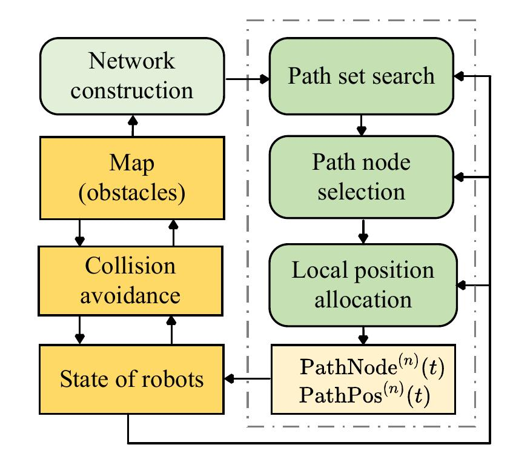
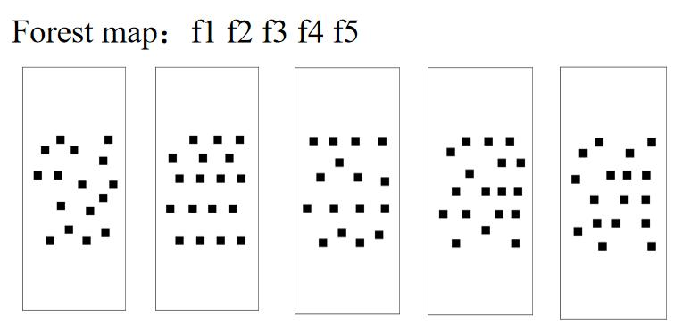
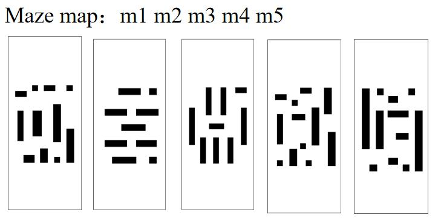
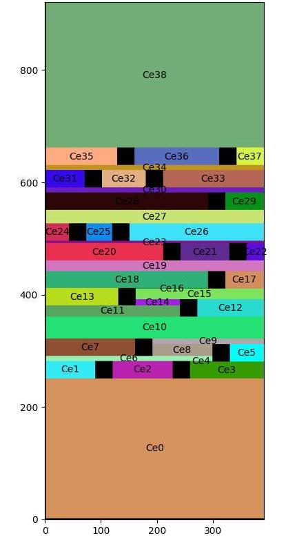
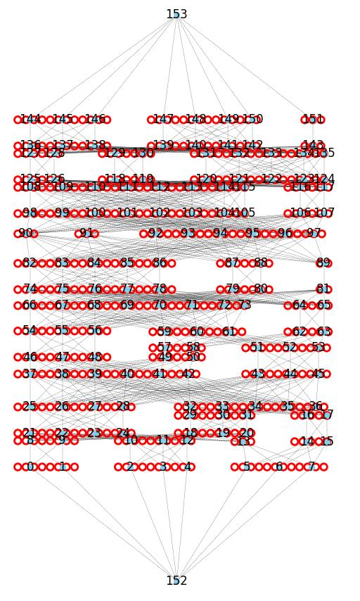

<div align="center">
<h2>Flow Inspired Multi-Robot Real-Time Scheduling Planner</h2>
</div>

## 📜 Introduction

### Abstract
Collision avoidance and trajectory planning are crucial in multi-robot systems, particularly in environments with numerous obstacles. Although extensive research has been conducted in this field, the challenge of rapid traversal through such environments has not been fully addressed. 
This paper addresses this gap by proposing a novel real-time scheduling scheme designed to optimize the passage of multi-robot systems through complex, obstacle-rich maps. Drawing inspiration from network flow optimization, our scheme decomposes the environment into a network structure, enabling the efficient allocation of robots to paths based on real-time congestion data. The proposed scheduling planner operates on top of existing collision avoidance algorithms, focusing on minimizing traversal time by balancing robot detours and waiting times. 
Our experimental results show high computational efficiency, with an average calculation time of around 0.9 seconds per instance for 500 robots.
We further validated the effectiveness of our scheme through real world flight tests involving ten quadrotors.
This work contributes a lightweight, effective scheduling planner capable of meeting the real-time demands of multi-robot systems in obstacle-rich environments.

### System overview

<div align=center></div>

## Simulations
### Forest maps num=500

<p align="center">
  
  
</p>

### Maze maps num=500

<p align="center">
  
  
</p>


## Real world flight test

<p align="center">
  
  
</p>


## 🛠️ Quick start


Requirements
- Gurobi
[Install Gurobi Optimizer](https://support.gurobi.com/hc/en-us/articles/4534161999889-How-do-I-install-Gurobi-Optimizer)

- json, logging, colorlog, itertools, matplotlib, numpy, networkx

Run the script directly.
```bash
python Simu_main.py
```

In the file "Simu_main.py", the following function is the main entry.
```python
set_debug_mode(True)
run_number_all_forest()
run_number_all_maze()
```

You can modify "forest_name_list" and "num_list" to run the corresponding map and number of robots.

```python
def run_number_all_forest():
    forest_name_list = ["f1"]
    # forest_name_list = ["f1", "f2", "f3", "f4", "f5"]
    num_list = [500]
    # num_list = [50, 100, 150, 200, 250, 300, 350, 400, 450, 500]

    # run forest map
    for map_name in forest_name_list:
        for swarm_num in num_list:
            logging.info("map = " + map_name)
            logging.info("swarm number=" + str(swarm_num))
            run_flow_planner(map_name, swarm_num, True)


def run_number_all_maze():
    # maze_name_list = ["m5", "m3", "m4"]
    maze_name_list = ["m1", "m2", "m3", "m4", "m5"]
    num_list = [50]
    # num_list = [30, 50, 80, 150, 200, 250, 300, 350, 400]


    # run maze map
    for map_name in maze_name_list:
        for swarm_num in num_list:
            logging.info("map = " + map_name)
            logging.info("swarm number=" + str(swarm_num))
            run_flow_planner(map_name, swarm_num, False)
```

In folders "\pic", we provide 5 forest maps and 5 maze maps. 
We also provide a map editor, you can use "draw.io" to open and edit the map you want.

<div align=center>


</div>

In function "def run_flow_planner(map_name, num, forest_bool):", you can get the effect of network construction by uncommenting line,
```python
# s1.mapInfo.draw_mapInfo()
```
<div align=center>


</div>

## Choice of collision avoidance algorithm

The default collision avoidance algorithm used in our scheme is RVO (reciprocal velocity obstacle). 

However, we also provide two other options for collision avoidance: VO (velocity obstacle) and HRVO (hybrid reciprocal velocity obstacle).

You can check the code in file "RVO_module/RVO.py" for more details.

```python
def RVO_update(self, X, V_des, V_current, ws_model, robot_exist)

def VO_update(self, X, V_des, V_current, ws_model, robot_exist)

def HRVO_update(self, X, V_des, V_current, ws_model, robot_exist)
```